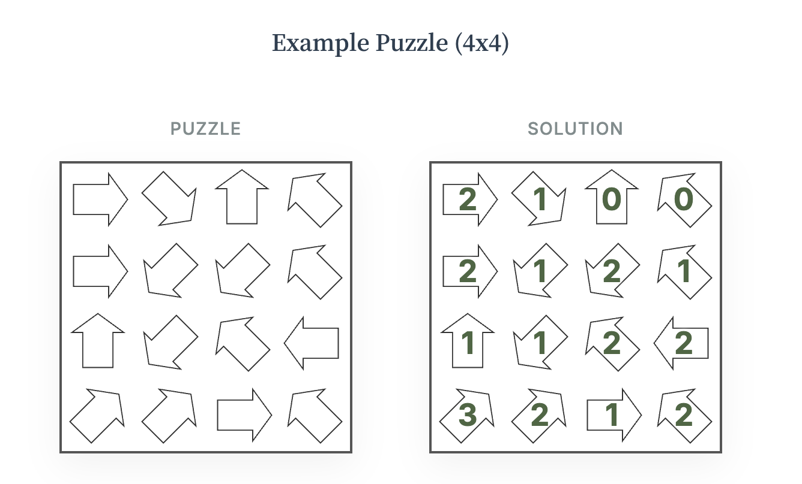

# Yazudo - Japanese Arrow Puzzle Generator

Try japanese arrow puzzles on [yazudo.app](https://yazudo.app)!

The rules are simple: 
- a number needs to be placed into each arrow
- the number equals the count of distinct numbers, which the arrow points at in a straight line

# Puzzle Generator

This repository contains a puzzle generator for the above puzzles. The fundamental goal behind the generator is to create puzzles that are interesting and fun for humans to solve. 

Computers typically solve problems quite differently from humans, by backtracking. However, backtracking is not popular nor (at large depths) feasible for humans, as it feels like guessing. Humans rather tend to solve puzzles based on logical elimination rules and patterns. When they use backtracking, then typically only by "guessing" one number and checking if they can reach a contradiction withing a few steps.

The `config/rules.yaml` file contains a set of such rules of varying complexity, and we can generate puzzles that are solvable by applying these rules, as well as (in harder puzzles) limited backtracking.

Rules are represented as first order formulae. For example, if two arrows are directly next to each other and point in the same direction, and the front arrow has value `i`, then the back arrow must have value `i` or `i+1`. This can be encoded as a rule using
- the condition `exists p,q,i (next(p) = q ^ dir(p) = dir(q) ^ val(q) = i)`
- the conclusion `only(p, [i,i+1])`

For more details, check out [Using Robots to Generate Puzzles for Humans](https://vanhavel.github.io/2026/02/01/generating-puzzles.html).